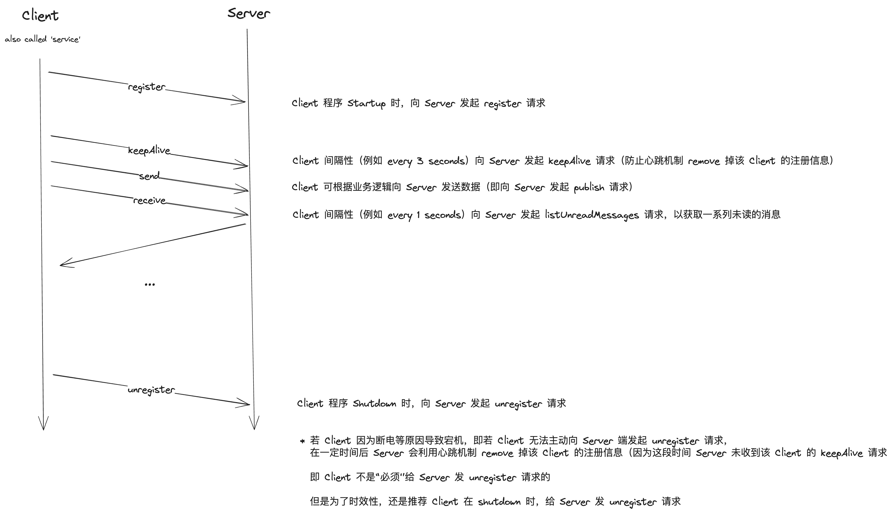

# Platform

面向“人-网-物三元融合”场景的**微服务无感知动态更新**平台

- 基于 Pub/Sub 的异步数据传输机制
- 资源注册机制（提供用户友好的 SDK：C++ header-only SDK 和 Java Spring Boot Starter）
- 基于 Docker 的应用管理功能
- 面向单机部署的网络代理策略（防止滚动更新过程中产生端口冲突问题）

## Pub/Sub Design

基于 Publish/Subscriber 模式，对微服务（Service）之间的数据流与数据传输方式进行建模：

- 基于 Topic 的抽象概念对 Service（Client of Platform）之间的消息通信进行解耦，使得 Service 之间非强依赖关系，以此实现了“Service 对其他 Service 的‘无感知上/下线’”
- 基于 Service-Name 抽象概念，对多版本的 Service 进行聚合，便于在 Service Update 的时候支持选择特定的版本进行数据传输
- 平台实现了 Plugin 机制，可通过自定义 Plugin 来对 Pub/Sub 数据传输进行增强，例如“心跳检测机制”与“订阅所有 Topic 数据”

### Pull Model

消息获取采用的是“拉模型”，定期主动向服务端发起“获取新消息”的请求，并在 client-side 依次调用 `onMessage` 回调

## Resource Design

## Application Design

## Proxy Design

